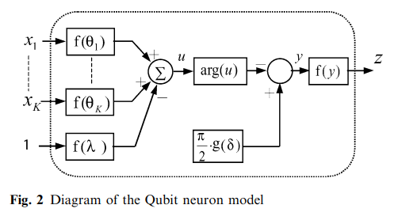
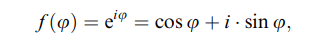
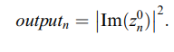
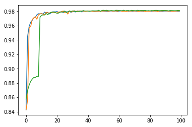
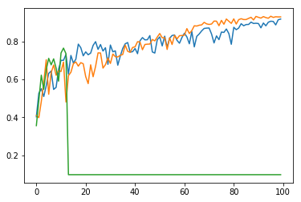
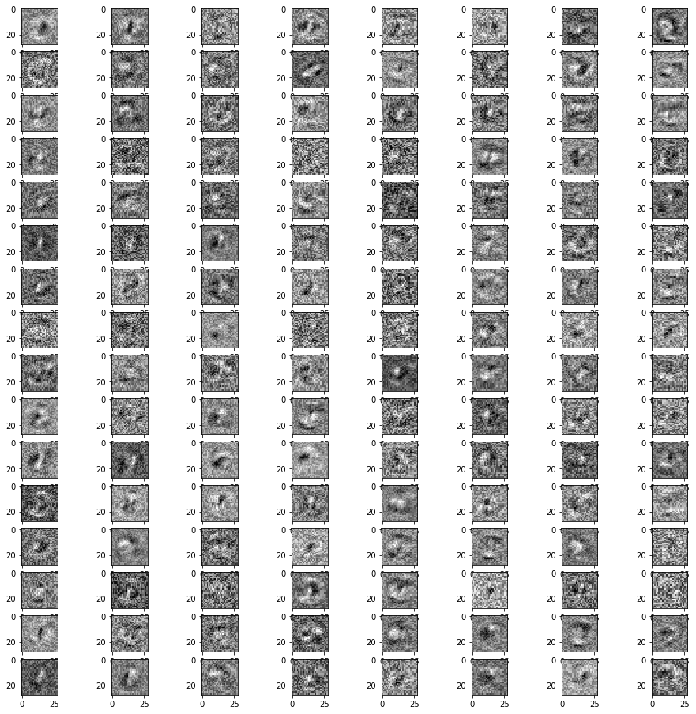
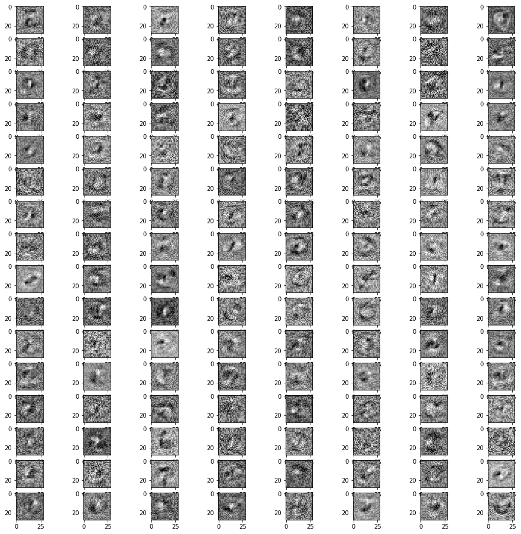
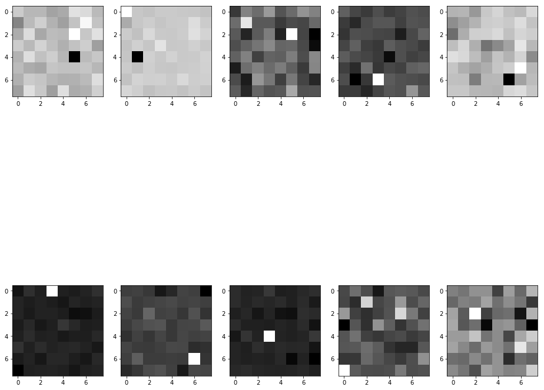
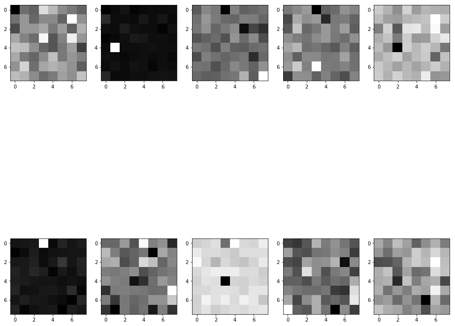

# Qubit-Neural-Network
This repo contains the replication of the results of the paper ["Qubit neural network and its learning efficiency"](https://link.springer.com/article/10.1007/s00521-004-0446-8).  

The code is written using Python `mxnet` with `mxnet.gluon`. Testing is performed using MNIST. Notebook contains an implementation of the qubit neural network design and its comparison with the default dense network.  
The complexity of the implementation was in the fact that **none of the existing symbolic frameworks support both complex number operations and chain-rule differentiation**.

## Article abstract
Neural networks have attracted much interest  
in the last two decades for their potential to realistically  
describe brain functions, but so far they have failed to  
provide models that can be simulated in a reasonable  
time on computers; rather they have been limited to toy  
models. Quantum computing is a possible candidate for  
improving the computational efficiency of neural networks.  
In this framework of quantum computing, the  
Qubit neuron model, proposed by Matsui and Nishimura,   
has shown a high efficiency in solving problems such  
as data compression. Simulations have shown that the  
Qubit model solves learning problems with significantly  
improved efficiency as compared to the classical model.  
In this paper, we confirm our previous results in further  
detail and investigate what contributes to the efficiency  
of our model through 4-bit and 6-bit parity check  
problems, which are known as basic benchmark tests.  
Our simulations suggest that the improved performance  
is due to the use of superposition of neural states and the  
use of probability interpretation in the observation of  
the output states of the model.  

## Qubit neuron
*The Qubit neuron model is a neuron model inspired by quantum physics and quantum computing: its neuron states are connected to quantum states, and transitions between neuron states are based on operations derived from quantum logic gates.*
  
  
  

## Implementation
The core of the implementation lies in the *forward* function. It takes the real-valued vector *fi_in* that corresponds to the phase given from the previous layer and transforms it according to the given algorithm.  
```
def forward(self, fi_in):
    # k x m
    x_re, x_im = self.get_re_im_from_fi(fi_in)
    
    theta_re = self.theta_re.data()
    theta_im = self.theta_im.data()
    lambda_re = self.lambda_re.data()
    lambda_im = self.lambda_im.data()
    delta = self.delta.data()
    
    # k x n             # k x m  # m x n
    x_re_theta_re = nd.dot(x_re, theta_re)
    x_re_theta_im = nd.dot(x_re, theta_im)
    x_im_theta_re = nd.dot(x_im, theta_re)
    x_im_theta_im = nd.dot(x_im, theta_im)
    
    # k x n
    x_theta_re = x_re_theta_re - x_im_theta_im
    x_theta_im = x_re_theta_im + x_im_theta_re
    
    # k x n            # n x 1
    u_re = x_theta_re - lambda_re
    u_im = x_theta_im - lambda_im
    
    # k x n
    arg = nd.arctan(u_im / u_re)
    
    # n x 1
    sigma = (np.pi / 2) * sigmoid(delta)
    
    # k x n
    y = -arg + sigma
    
    # k x n
    fi_out = y
    
    # k x n
    activation = linear(fi_out)
    return activation
```

## Testing
Accuracy by iteration for **dense net** with the same number of units:  
  

Accuracy by iteration for **qubit net** with the same number of units:  
(one of the runs got stuck)  
  

## Weights visualization
#### Layer 0 Imaginary part:  
  

#### Layer 0 Real part:  
  

#### Layer 2 Imaginary part:  
  

#### Layer 2 Real part:  
  

## Conclusion
Since the description of the training procedure updates and some details were not covered in the paper, I've had to reconstruct missing gaps by myself.  
Author's way of storing weights as a unit length vector was not viable when I reproduced the system that way, so I switched to not restricting the complex number norm by one.  
The results display dense net superiority, nevertheless, the future studies (there is a chance that they will be available for publication soon) has shown that there is a way to implement this network to have an equal performance (with more computational complexity giving faster training).